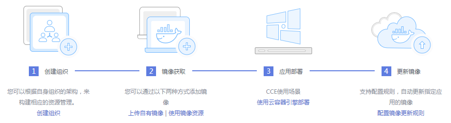
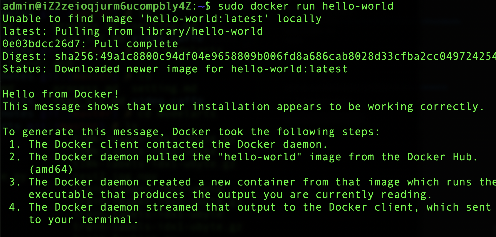
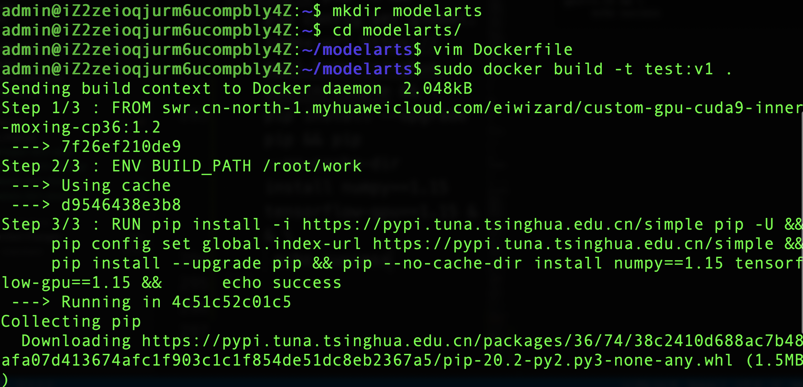
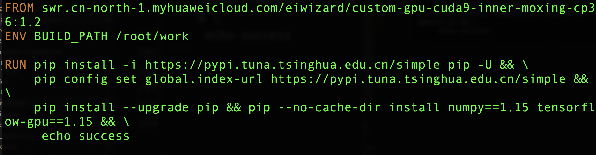
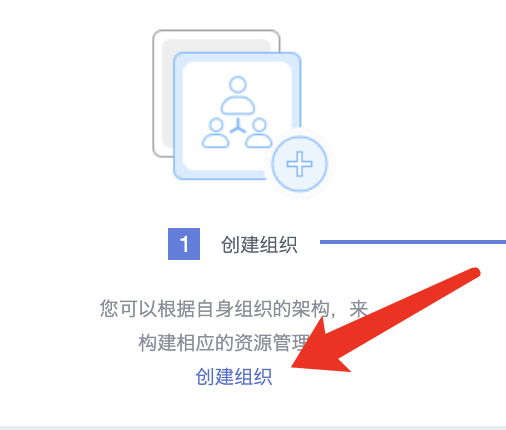
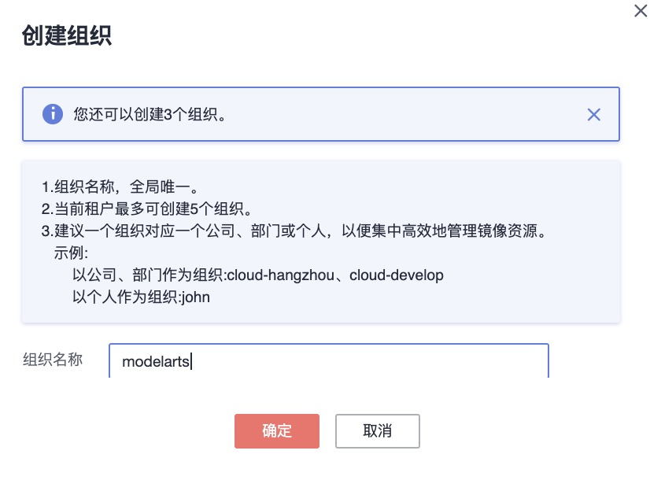
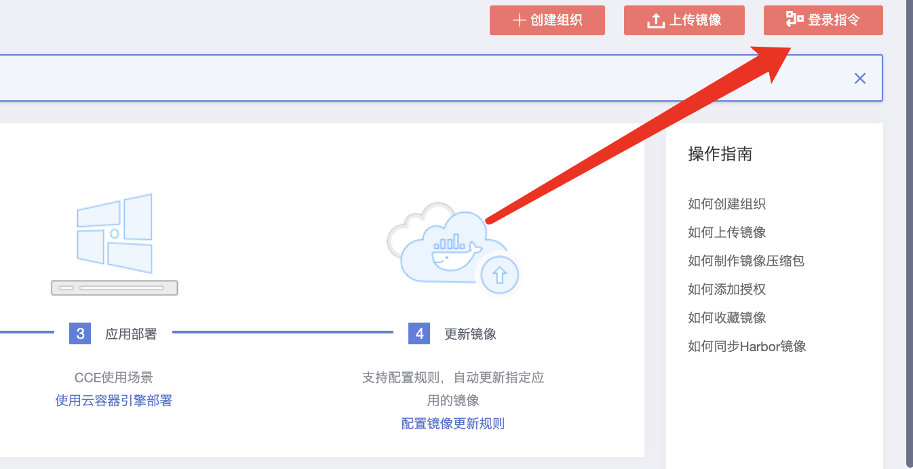
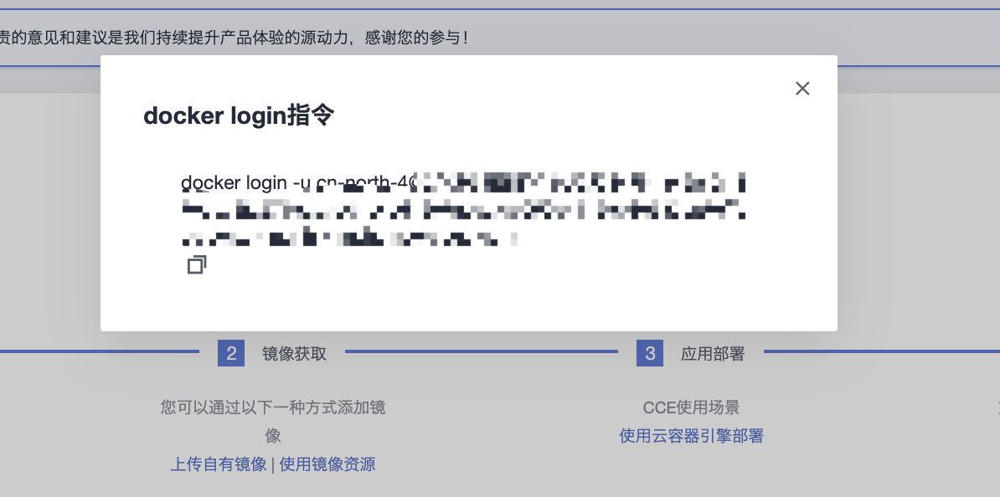
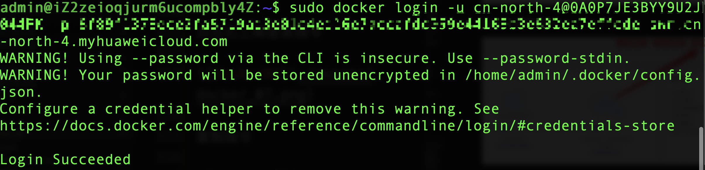
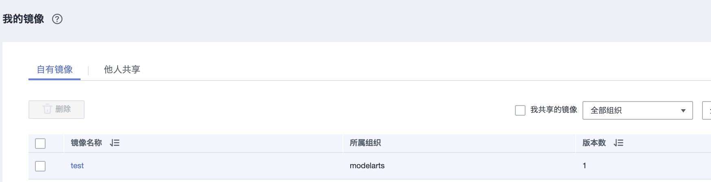

## 自定义镜像训练

1. 自定义镜像概述

ModelArts 提供了多种预置引擎，但是当用户对深度学习引擎、开发库有特殊需求的场景的时候，预置引擎已经不能满足用户需求。此时用户可以使用 ModelArts 自定义镜像这个功能来达到自定义运行引擎的目的。

ModelArts 底层采用容器技术，自定义镜像指的是用户自行制作容器镜像并在 ModelArts 上运行。自定义镜像功能支持自由文本形式的命令行参数和环境变量，因此灵活性比较高，便于支持任意计算引擎的作业启动需求。

文中出现的英文缩略词意思分别为：SWR--华为云容器镜像服务，OBS--华为云对象存储服务。

## 介绍

## docker

Docker是一个开源的引擎，可以轻松的为任何应用创建一个轻量级的、可移植的、自给自足的容器。容器镜像服务兼容原生Docker，支持使用Docker CLI和原生API管理容器镜像。了解更多的docker知识参考文档https://docs.docker.com/

## swr

容器镜像服务（Software Repository for Container，简称SWR）是一种支持镜像全生命周期管理的服务，提供简单易用、安全可靠的镜像管理功能，包括镜像的上传、下载、删除等。

SWR提供私有镜像库，并支持细粒度的权限管理，可以为不同用户分配相应的访问权限（读取、编辑、管理）。SWR还支持容器镜像版本更新自动触发部署。您只需要为镜像设置一个触发器，通过触发器，可以在每次镜像版本更新时，自动更新云容器引擎（CCE）中使用该镜像部署的应用。

您可以通过控制台、API使用容器镜像服务。



## 使用容器镜像服务

2. 自定义镜像功能使用步骤

ModelArts中使用自定义功能步骤如下：

- 制作自定义镜像。
- 传自定义镜像到华为云 SWR。
- 在 ModelArts 上使用自定义镜像训练功能。

2.1 制作自定义镜像

制作自定义镜像时，需要往镜像中添加一些必要的深度学习库及用户编写的脚本等。

2.1.1 自定义镜像有如下规范要求：

- 自定义镜像必须基于ModelArts官方提供的基础镜像，支持的基础镜像请参考基础镜像包。
- 自定义镜像中不能包含恶意代码。
- 基础镜像中的部分内容不能改变，包括“/bin”、“/sbin”、“/usr”、“/lib(64)”下的所有文件，“/etc”下的部分重要配置文件，以及“$HOME”下的ModelArts小工具。
- 不可以新增属主为“root”且权限包含“setuid”或“setgid”位的文件。
自定义镜像大小不能超过9.5GB。
- 日志文件输出，为保证日志内容可以正常显示，日志信息需要打印到标准输出。

2.1.2 基础镜像包

基础镜像中有一些必要的工具，用户需要基于ModelArts官方提供的基础镜像来制作自定义镜像。
ModelArts将持续更新基础镜像版本，基础镜像更新后，对于兼容性更新，用户还可以继续使用旧的镜像；对于不兼容性更新，基于旧版本制作的自定义镜像将不能在ModelArts上运行，但已经审核过的自定义镜像可以继续使用。
当用户发现自定义镜像审核不通过，并且审核日志中出现基础镜像不匹配的错误信息时，需要使用新的基础镜像重新制作镜像。

基础镜像基础组件:

run_train.sh :训练启动引导脚本。实现了代码目录下载，执行训练命令、重定向训练日志输出、以及训练命令结束后上传日志文件至OBS的功能。

utils.sh : 工具脚本。“run_train.sh”脚本依赖此脚本。提供了SK解密，代码目录下载，日志文件上传等方法。

ip_mapper.py:网卡地址获取脚本。默认获取ib0网卡地址IP，训练代码可以使用ib0网卡的IP加速网络通信。

dls-downloader.py:OBS下载脚本。“utils.sh”脚本依赖此脚本。

完整的基础镜像内容可参考:https://github.com/huaweicloud/ModelArts-Lab/tree/master/docs/custom_image/custom_base

举一例子：

```
# Dockerfile-custom-cpu-base

FROM dls.io/dls/ubuntu_base:16.04-latest

ARG download
ARG username
ARG usergroup
ARG workname
ARG workgroup


RUN groupadd -g 1100 Misplaced &username -m -u 1100 -g 1100 -s /bin/bash $username &&\
  groupadd -g 1101 Misplaced &workname -m -u 1101 -g 1101 -s /bin/bash $workname && \
  mkdir /cache && chown -R workname:workgroup /cache && chmod 755 /cache

RUN mv /etc/apt/sources.list /etc/apt/sources.list~ && \
  wget ${download}/dls-release/ubuntu-16.04/ci-config/sources.list -P /etc/apt/ && \
  apt-get update && \
  apt-get install -y python-pip \
    libcurl4-openssl-dev && \
  echo "" > /etc/apt/apt.conf && \
  rm -f /etc/apt/sources.list && \
  rm -rf /var/lib/apt/lists/* && \
  mv /etc/apt/sources.list~ /etc/apt/sources.list && \
  chmod -R -s /usr/local/lib

RUN mkdir -p /home/install && cd /home/install && \
  wget $download/dls-release/ubuntu-16.04/dls-tools-master/latest/dls-decryptor && \
  chown root:root dls-decryptor && \
  chmod 4755 dls-decryptor && \
  mv dls-decryptor /usr/bin/ && \
  wget $download/dls-release/ubuntu-16.04/dls-tools-master/latest/dls-dns-fixer.tar.gz && \
  tar -xvzf dls-dns-fixer.tar.gz && chown root:root dls-dns-fixer && \
  chmod 6755 dls-dns-fixer && mv -v dls-dns-fixer /usr/bin/ && \
  wget $download/dls-release/ubuntu-16.04/dls-tools-master/latest/dls-pipe.tar.gz && \
  tar -xzf dls-pipe.tar.gz && chown 1100:1100 modelarts-pipe &&  chmod 6755 modelarts-pipe && \
  mv modelarts-pipe /usr/bin/ && \
  wget $download/dls-release/ubuntu-16.04/dls-tools-master/latest/dls-key-client.tar.gz && \
  tar -xzf dls-key-client.tar.gz && chown root:root dls-key-client && chmod 0755 dls-key-client && \
  mv -v dls-key-client /usr/bin/ && \
  wget $download/dls-release/ubuntu-16.04/dls-tools-master/latest/dls-downloader.tar.gz && \
  tar -xzf dls-downloader.tar.gz && mv -v dls-downloader/modelarts-downloader.py /home/$workname/ && \
  wget $download/dls-release/ubuntu-16.04/dls-tools-master/latest/ip-mapper.tar.gz && \
  tar -xzf ip-mapper.tar.gz && \
  mv -v ip-mapper/ip_mapper.py /home/$workname/ && \
  mv -v ip-mapper/get_cluster_ib_ip.py /home/$workname/ && \
  wget $download/dls-release/ubuntu-16.04/dl-scripts-master/latest/scripts.tar.gz 2>/dev/null && \
  tar -xzf scripts.tar.gz && \
  cp -rpf scripts/run_config/common/utils/utils.sh /home/$workname/ && \
  cp -rpf scripts/run_config/custom/train/run_train.sh /home/$workname/ && \
  rm -rf /home/install

RUN mkdir -p /home/install && cd /home/install && \
  mkdir -p ~/.pip/ && \
  wget $download/dls-release/ubuntu-16.04/ci-config/pip.conf && mv pip.conf ~/.pip/ && \
  pip install boto3==1.7.29 netifaces==0.10.7 pyzmq==17.0.0 && \
  rm -rf ~/.pip/ && \
  cd /home && \
  rm -rf /home/install && \
  mkdir -p ~/.pip/ && \
  wget $download/dls-release/ubuntu-16.04/ci-config/pip-hwcloud.conf && \
  mv pip-hwcloud.conf ~/.pip/pip.conf
```

ModelArts提供的基础镜像名称格式如下

```
swr.<region>.myhuaweicloud.com/<image org>/custom-<processor type>-[<cuda version>]-base:<image tag>
```

参数说明:

```
|
参数
|
支持的值
|
说明
|
```

```
| 
<region> 
| 
cn-north-1
cn-north-2
cn-north-4
cn-south-1
ap-southeast-1
cn-north-5 
|
镜像所在的区域。支持的值中，分别表示：
北京一
北京二
北京四
华南广州
亚太香港
|

```

```
|
<image org>
|
modelarts-job-dev-image
|
镜像所属组织。使用“modelarts-job-dev-image”。
|
```

```
|
<processor type>
|
cpu
gpu
|
处理器类型
|
```
```
|
<cuda version>
|
cuda92
cuda9
cuda8
|
镜像中已安装的CUDA版本。
当<processor type>为gpu时，<cuda version>才会生效。
|
```
```
|
<image tag>
|
1.0
1.1
1.2
1.3
|
镜像版本。建议使用最新镜像版本“1.3”。
|
```

例如，在“华北-北京一”区域，ModelArts支持的基础镜像列表如下，您可根据个人需求选择相应的镜像。
```
swr.cn-north-1.myhuaweicloud.com/modelarts-job-dev-image/custom-cpu-base:1.3
swr.cn-north-1.myhuaweicloud.com/modelarts-job-dev-image/custom-gpu-cuda92-base:1.3
swr.cn-north-1.myhuaweicloud.com/modelarts-job-dev-image/custom-gpu-cuda9-base:1.3
swr.cn-north-1.myhuaweicloud.com/modelarts-job-dev-image/custom-gpu-cuda8-base:1.3
...
```

2.1.3 制定自定义镜像

2.1.3.1 搭建docker环境

在自己电脑搭建Docker环境，也可以在华为云上的申请一台ECS来搭建Docker环境。

参考docker安装文档

https://docs.docker.com/engine/install/

1. 建立仓库

更新apt包索引然后安装包去允许apt通过HTTPS用库

sudo apt-get update

sudo apt-get install \
    apt-transport-https \
    ca-certificates \
    curl \
    gnupg-agent \
    software-properties-common


2. 添加docker官方GPG key

curl -fsSL https://download.docker.com/linux/ubuntu/gpg | sudo apt-key add -

sudo apt-key fingerprint 0EBFCD88

3. 建立stable库

sudo add-apt-repository \
   "deb [arch=amd64] https://download.docker.com/linux/ubuntu \
   $(lsb_release -cs) \
   stable"

4. 下载DOCKER ENGINE

sudo apt-get update

sudo apt-get install docker-ce docker-ce-cli containerd.io

5. 验证是否下载成功

sudo docker run hello-world



## 制作并上传自定义镜像

1. 编写自定义镜像的 Dockerfile

训练作业的自定义镜像需要以基础镜像为基础。根据``docker pull swr.<region>.myhuaweicloud.com/<image org>/custom-<processor type>-[<cuda version>]-base:<image tag>``格式。


我们先编写Dockerfile文件。

```
FROM swr.cn-north-1.myhuaweicloud.com/eiwizard/custom-gpu-cuda9-inner-moxing-cp36:1.2
ENV BUILD_PATH /root/work

RUN pip install -i https://pypi.tuna.tsinghua.edu.cn/simple pip -U && \
    pip config set global.index-url https://pypi.tuna.tsinghua.edu.cn/simple && \
    pip install --upgrade pip && pip --no-cache-dir install numpy==1.15 tensorflow-gpu==1.15 && \
     echo success
```






## 推送镜像至SWR

在SWR界面上创建一个组织，然后获取SWR登录指令.






点击右上角登录指令,单击复制docker login指令。docker login指令末尾的域名即为当前镜像仓库地址，记录该地址。








在安装docker的机器给test:v1镜像打标签。

docker tag [镜像名称:版本名称] [镜像仓库地址]/[组织名称]/[镜像名称:版本名称]

样例如下：

sudo docker tag test:v1 swr.cn-north-4.myhuaweicloud.com/modelarts/test:v1

其中：

swr.cn-north-4.myhuaweicloud.com为容器镜像服务的镜像仓库地址。
modelarts为组织名称，如果该组织还没有创建，容器镜像服务会根据组织名称自动创建一个组织。
test:v1为镜像名称和版本号。

上传镜像至镜像仓库。

docker push [镜像仓库地址]/[组织名称]/[镜像名称:版本名称]

样例如下：

sudo docker push swr.cn-north-4.myhuaweicloud.com/modelarts/test:v1




这样就上传成功了。

## 在ModelArts中使用自定义镜像创建作业

2.3.1 创建自定义镜像训练用户作业

