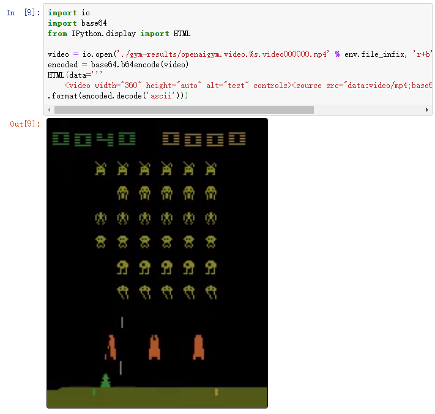

## 强化学习实战

1. 安装gym环境

openai gym工具箱提供了一系列物理仿真环境，游戏，机器人仿真。我们可以基于gym提供的环境来设计强化学习的agent。

```python
!pip install --upgrade pip
!pip install 'gym[atari]'
```

引入包所需的包

```pythom
import numpy as np
import pandas as pd
import tensorflow as tf
import matplotlib.pyplot as plt
from sklearn.utils import shuffle
import gym
```

一些超参数设置

```python
end_game_reward = -100
hidden_layers = [12,12]
gamma = 0.99
learning_rate = 0.0001
internal = 100
env_name = 'SpaceInvaders-v0'
env = gym.make(env_name)
w,h,d = env.observation_space.shape
state_num = w * h * d
```

我们分别打印出可用 action，可用的 observation, observation 最高值，observation 最低值

```python
print(env.action_space)
print(env.observation_space)
print(env.observation_space.high) 
print(env.observation_space.low)
```

我们来定义gradient policy的类

```python

class PolicyGradient:
    def __init__(self, state_size, num_of_actions, hidden_layers, learning_rate):
        self.states = tf.placeholder(shape=(None, state_size), dtype=tf.float32, name='input_observation') ## 接收 observation
        self.acc_r = tf.placeholder(shape=None, dtype=tf.float32, name='accumalated_rewards') # 接收每个 state-action 所对应的 value (通过 reward 计算)
        self.actions = tf.placeholder(shape=None, dtype=tf.int32, name='actions') ## 接收action
        layer = self.states
        ## 堆叠神经网络层
        for i in range(len(hidden_layers)):
            layer = tf.layers.dense(inputs=layer, units=hidden_layers[i], activation=tf.nn.relu,
                                    kernel_initializer=tf.contrib.layers.xavier_initializer(),
                                    name='hidden_layer_{}'.format(i+1))
        self.last_layer = tf.layers.dense(inputs=layer, units=num_of_actions, activation=tf.nn.tanh,
                                          kernel_initializer=tf.contrib.layers.xavier_initializer(),
                                          name='output')
        self.action_prob = tf.nn.softmax(self.last_layer)  # 激励函数 softmax 出概率
        self.log_policy = tf.nn.sparse_softmax_cross_entropy_with_logits(logits=self.last_layer, labels=self.actions) # 所选 action 的概率 -log 值
        # log_policy = tf.reduce_sum(-tf.log(self.log_policy)*tf.one_hot(self.actions, self.num_of_actions), axis=1)
        self.cost = tf.reduce_mean(self.acc_r * self.log_policy) # (acc_r = 本reward + 衰减的未来reward) 引导参数的梯度下降
         # 最大化 总体 reward (acc_r * log_policy) 就是在最小化 -(acc_r * log_policy), 而 tf 的功能里只有最小化 loss
        self.optimizer = tf.train.AdamOptimizer(learning_rate=learning_rate).minimize(self.cost)
```

定义policygradient:

```python

pg = PolicyGradient(state_size=state_num, num_of_actions=env.action_space.n,
                    hidden_layers=hidden_layers, learning_rate=learning_rate)
```

进入主循环

```python 
from scipy.stats import zscore
def print_stuff(s, every=100):
    if game % every == 0 or game == 1:
        print(s)
sess = tf.Session()
sess.run(tf.global_variables_initializer())
data = pd.DataFrame(columns=['game','steps','cost'])

for g in range(1500):
    game = g+1
    done = False
    ## init env
    observation = env.reset()
    states = [] 
    rewards = [] 
    actions = []
    steps = 0
    print_stuff('Starting game {}'.format(game))
    while not done:
        steps += 1
        observation = observation.flatten()[np.newaxis, :]
        
        probs = sess.run(pg.action_prob, feed_dict={pg.states: observation}).flatten()
        # 选择action
        action = np.random.choice(env.action_space.n, p=probs)

        ## 根据这个action, 给出下一个state,reward,是否游戏结束
        next_state, r, done, _ = env.step(action)
        if done and steps < env._max_episode_steps: r = end_game_reward
        
        # 存储这一回合的数据
        states.append(observation)
        rewards.append(r)
        actions.append(action)
        observation = next_state
    print_stuff('Game {g} has ended after {s} steps.'.format(g=game, s=steps))
    
    discounted_acc_rewards = np.zeros_like(rewards)
    s = 0.0
    for i in reversed(range(len(rewards))):
        s = s * gamma + rewards[i]
        discounted_acc_rewards[i] = s
    discounted_acc_rewards = zscore(discounted_acc_rewards)
    
    states, discounted_acc_rewards, actions = shuffle(states, discounted_acc_rewards, actions)
    # Update the policy network with the data from one episode.
    # 用一轮数据更新policy gradient 网络
    c, _ = sess.run([pg.cost, pg.optimizer], feed_dict={pg.states: np.squeeze(states), 
                                                        pg.acc_r: discounted_acc_rewards,
                                                        pg.actions: actions})    
    
    print_stuff('Cost: {}\n----------'.format(c))
    data = data.append({'game':game, 'steps':steps, 'cost':c}, ignore_index=True)
```

捕捉视频存下

```python
from gym import wrappers
env = wrappers.Monitor(env, "./gym-results", force=True)
env.reset()
for _ in range(5000):
    action = env.action_space.sample()
    observation, reward, done, info = env.step(action)
    if done: break
env.close()
```

```python
import io
import base64
from IPython.display import HTML

video = io.open('./gym-results/openaigym.video.%s.video000000.mp4' % env.file_infix, 'r+b').read()
encoded = base64.b64encode(video)
HTML(data='''
    <video width="360" height="auto" alt="test" controls><source src="data:video/mp4;base64,{0}" type="video/mp4" /></video>'''
.format(encoded.decode('ascii')))
```



